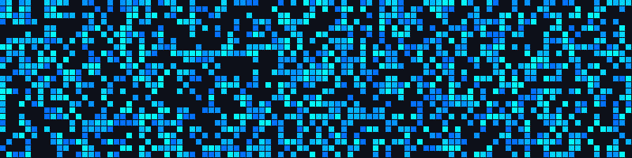

<div align="center">
  
  

</div>


## 🎮 Automatic Snake Game

Watch the snake collect commits!

<div align="center">
  
  
  
</div>


## 🚀 About Me
``` javascript
const developer = {
    role: "Full Stack Engineer",
    location: "🌍 Somewhere on the internet",
    challenge: "Learning something new every day",
    funFact: "Bugs aren't errors, they're undocumented features 🐛"
};
```


## 🎮 Coding Journey

<div align="center">
  
  +%7B+code()+%7D;if(bugs)+%7B+coffee()+%7D;git+commit+-m+"fixed+it";sudo+make+me+a+sandwich;console.log('Hello+World!');import+awesome+from+'developer')
  
</div>

## 🏆 GitHub Achievements

<div align="center">
  
  
  
  
  
  
  
  

</div>

## 💻 Technologies & Tools

<div align="center">

  <!-- 🧠 Programming Languages -->
  
  
  
  
  
  
  
  
  
  
  
  
  
  
  
  
  
  
  
  
  

  <br/>

  <!-- 🎨 Frontend -->
  
  
  
  
  
  
  
  
  
  
  
  
  
  
  
  
  
  
  
  
  
  
  
  
  
  
  
  
  
  
  

  <br/>

  <!-- 📱 Mobile Development -->
  
  
  
  
  
  
  

  <br/>

  <!-- ⚙️ Backend -->
  
  
  
  
  
  
  
  
  
  
  
  
  
  
  
  
  
  
  
  
  
  
  

  <br/>

  <!-- 🗄️ Databases -->
  
  
  
  
  
  
  
  
  
  
  
  
  
  
  
  
  
  

  <br/>

  <!-- ☁️ Cloud & Infrastructure -->
  
  
  
  
  
  
  
  
  
  
  

  <br/>

  <!-- 🐳 DevOps & CI/CD -->
  
  
  
  
  
  
  
  
  
  
  
  
  
  
  

  <br/>

  <!-- 🔧 Version Control & Collaboration -->
  
  
  
  

  <br/>

  <!-- 🖥️ Operating Systems & Low-Level -->
  
  
  
  
  
  
  
  
  

  <br/>

  <!-- 🤖 AI / ML / Data Science -->
  
  
  
  
  
  
  
  
  
  
  
  
  
  
  

  <br/>

  <!-- 🔐 Security & Authentication -->
  
  
  
  
  
  

  <br/>

  <!-- 🧪 Testing -->
  
  
  
  
  
  
  
  

  <br/>

  <!-- 📦 Package Managers -->
  
  
  
  
  
  
  

  <br/>

  <!-- 🧰 Tools & IDEs -->
  
  
  
  
  

</div>


## 🔥 Activity

<div align="center">

  

</div>


## 💬 Meme of the Day

<div align="center">


</div>


## 📫 Connect with Me

<div align="center">

[](https://t.me/xpl0itK3y)
[](mailto:your.email@example.com)
[](https://linkedin.com/in/YOUR_LINKEDIN)
[](https://your-website.com)

</div>


## 💚 Matrix Mode

<div align="center">
  
  
  
</div>

## ⏱️ WakaTime Coding Stats

<!--START_SECTION:waka-->

```python
From: 17 December 2025 - To: 24 December 2025

Total Time: 6 hrs 10 mins

JavaScript     3 hrs 43 mins   ░░░░░░░░░░░░░░░▓▓▓▓▓▓▓▓▓▓   60.41 %
TypeScript     47 mins         ░░░▓▓▓▓▓▓▓▓▓▓▓▓▓▓▓▓▓▓▓▓▓▓   12.89 %
JSON           20 mins         ░▒▓▓▓▓▓▓▓▓▓▓▓▓▓▓▓▓▓▓▓▓▓▓▓   05.57 %
Markdown       16 mins         ░▓▓▓▓▓▓▓▓▓▓▓▓▓▓▓▓▓▓▓▓▓▓▓▓   04.41 %
YAML           16 mins         ░▓▓▓▓▓▓▓▓▓▓▓▓▓▓▓▓▓▓▓▓▓▓▓▓   04.37 %
```

<!--END_SECTION:waka-->


## 📊 Animated Metrics

<div align="center">

  

</div>


## 🧬 Conway's Game of Life

Cells live and evolve on their own!

<div align="center">
  
  
  
</div>


<div align="center">
  
  
  
</div>
